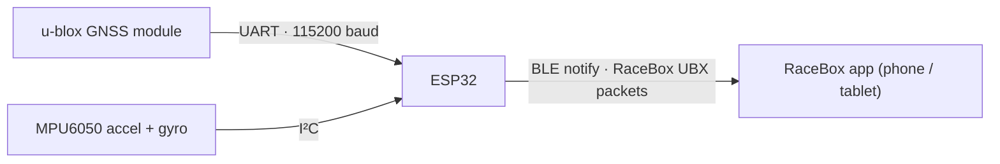

# RaceBox Mini Emulator

[](LICENSE)
[](https://www.espressif.com/en/products/socs/esp32)
[-00599C.svg)](https://www.arduino.cc/)

Turns an ESP32, a GNSS module, and an MPU6050 into a device that looks and behaves
like a **[RaceBox Mini](https://www.racebox.pro/)** GPS performance meter. The
official RaceBox app and other RaceBox-compatible tools can connect to it over
Bluetooth Low Energy (BLE) and read live position, speed, and motion data.

This is a low-cost, hackable platform for experimenting with GNSS data logging,
the RaceBox BLE protocol, and sensor fusion built from off-the-shelf parts.

I originally started this project as an emulator built for use with the [AutoX Data Logger for iOS](https://autoxdrivermod.com) app.

> [!IMPORTANT]
> **Unofficial project.** This is an independent, educational implementation. It is
> **not affiliated with, endorsed by, or supported by RaceBox.** "RaceBox" and
> related marks belong to their respective owner. Use it for learning and personal
> experimentation, at your own risk. Do not use it to impersonate a genuine device
> for any commercial or fraudulent purpose.

---

## What it does

- Reads a live **GNSS fix** (position, altitude, speed, heading, accuracy, fix
  status, satellite count) from a u-blox GNSS receiver at up to **25 Hz**.
- Reads **acceleration and rotation** from an MPU6050 6-axis IMU, with smoothing
  and optional gyro-bias calibration at startup.
- Packs everything into the **RaceBox Data Message** (a u-blox UBX-framed binary
  packet) and streams it over **BLE** to any RaceBox-compatible client.
- Advertises a BLE **Device Information Service** (model, serial, firmware,
  hardware, manufacturer) so official apps recognize and pair with it.
- Prints a human-readable **serial status line** (1 Hz) for debugging: packet
  rate, satellite count, fix type, horizontal accuracy, position, and IMU values.



---

## Hardware

| Part | Notes |
|------|-------|
| [**ESP32 dev board**](https://www.amazon.com/dp/B0DF2YJSHN) | Developed on an ESP32-WROOM DevKit V1 (30-pin). See [`Documentation/`](Documentation/) for the pinout. |
| [**u-blox GNSS module**](https://www.amazon.com/dp/B0CB5N8RQ8) | A u-blox **M10**-class receiver. Reference unit: HGLRC M100-5883 (datasheet in [`Documentation/`](Documentation/)). Other u-blox modules supported by the SparkFun library should work. |
| [**MPU6050**](https://www.amazon.com/dp/B01DK83ZYQ) | I²C 6-axis accelerometer + gyroscope breakout. Reference unit: HiLetgo GY-521 MPU-6050 (datasheet in [`Documentation/`](Documentation/)). |
|[**Project Box**](https://www.amazon.com/dp/B0BQYPKRQS)| ABS Plastic Project Case, White, 3.15 x 1.97 x 1.02 inch (80 x 50x 26 mm). You need to cut holes into this box to fit your specific board and component layout (see images below). |
|[**Nylon M2.5 hex standoffs**](https://www.amazon.com/dp/B0FPMC9917) | Nylon hex standoffs, washers, nuts, screws, to help with orienting the components within the project box. |

### Wiring

**GNSS module → ESP32 (UART, Serial2)**

| GNSS pin | ESP32 pin |
|----------|-----------|
| TX       | GPIO16 (RX2) |
| RX       | GPIO17 (TX2) |
| VCC      | 3V3 |
| GND      | GND |

**MPU6050 → ESP32 (I²C)**

| MPU6050 pin | ESP32 pin |
|-------------|-----------|
| SDA         | GPIO21 (default I²C SDA) |
| SCL         | GPIO22 (default I²C SCL) |
| VCC         | VIN (5V pin) |
| GND         | GND |

**Status LED:** the onboard LED (GPIO2) blinks while waiting for a BLE connection
and stays solid once a client is connected.

> Pin assignments for the GNSS UART and the LED are configurable in
> [`config.h`](src/esp32_racebox_mini_emulator/config.h). The MPU6050 uses the
> ESP32's default I²C pins.

---

## Build gallery

Photos of the reference build, from loose components to the finished, enclosed unit.
Several shots show an **RF shield** fitted over the electronics — a hardware
counterpart to the firmware's reduced BLE power that further isolates the GNSS
receiver from radio noise (see
[A note on BLE power and GNSS lock](#a-note-on-ble-power-and-gnss-lock)).

<div align="center">
  <br>
  <sub>The completed emulator, decorated with the stickers that came with the GNSS module and an indicator of which end points forward (for Gyro/Accelerometer)</sub>
</div>

<table>
  <tr>
    <td align="center" width="50%">
      <br>
      <sub>&nbsp;Components and enclosure prior to assembly</sub>
    </td>
    <td align="center" width="50%">
      <br>
      <sub>&nbsp;GNSS module with mounting hole in the lid</sub>
    </td>
  </tr>
  <tr>
    <td align="center" width="50%">
      <br>
      <sub>&nbsp;Components wired together, using header pins underneath the ESP32 board</sub>
    </td>
    <td align="center" width="50%">
      <br>
      <sub>Assembled, using hardening epoxy putty to firmly affix the components</sub>
    </td>
  </tr>
  <tr>
    <td align="center" width="50%">
      <br>
      <sub>RF shield test fit, not yet grounded or affixed</sub>
    </td>
    <td align="center" width="50%">
      <br>
      <sub>RF shield grounded; I used two-sided tape to mount the shield</sub>
    </td>
  </tr>
  <tr>
    <td align="center" width="50%">
      <br>
      <sub>Enclosure closed up, ready to test (before stickers!)</sub>
    </td>
    <td align="center" width="50%"></td>
  </tr>
</table>

---

## Software & dependencies

- **[Arduino IDE](https://www.arduino.cc/en/software)** (2.x recommended) or
  **[arduino-cli](https://arduino.github.io/arduino-cli/)**.
- **ESP32 board support** — install the `esp32` package by Espressif via the
  Boards Manager.
- Libraries (install via Library Manager):
  - **Adafruit MPU6050** (pulls in Adafruit Unified Sensor + Adafruit BusIO)
  - **SparkFun u-blox GNSS Arduino Library**
  - BLE support is built into the ESP32 Arduino core — no extra install needed.

---

## Build & flash

### Arduino IDE

1. Install the ESP32 board package and the libraries listed above.
2. Open [`src/esp32_racebox_mini_emulator/esp32_racebox_mini_emulator.ino`](src/esp32_racebox_mini_emulator/esp32_racebox_mini_emulator.ino).
3. Edit [`config.h`](src/esp32_racebox_mini_emulator/config.h) (at minimum, set your `DEVICE_ID`).
4. Select your board (e.g. **ESP32 Dev Module**) and the correct serial port.
5. Click **Upload**.
6. Open the **Serial Monitor** at **115200 baud** to watch the startup and status output.

### arduino-cli

```bash
# one-time setup
arduino-cli core install esp32:esp32
arduino-cli lib install "Adafruit MPU6050" "SparkFun u-blox GNSS Arduino Library"

# from the repo root — compile and upload (adjust the port)
arduino-cli compile --fqbn esp32:esp32:esp32 src/esp32_racebox_mini_emulator
arduino-cli upload  --fqbn esp32:esp32:esp32 -p /dev/ttyUSB0 src/esp32_racebox_mini_emulator
```

---

## Configuration

All user-tunable settings live in
[`config.h`](src/esp32_racebox_mini_emulator/config.h), grouped into sections.
Highlights:

| Setting | Purpose |
|---------|---------|
| `DEVICE_ID` | 10-digit device serial as a **quoted string** (e.g. `"3608675309"`). Validated at compile time: exactly 10 digits, first digit `0`–`3`. |
| `MODEL`, `FIRMWARE_VERSION`, `HARDWARE_VERSION`, `MANUFACTURER` | Values reported via the BLE Device Information Service. |
| `GPS_RX_PIN`, `GPS_TX_PIN`, `ONBOARD_LED_PIN` | Hardware pin assignments. |
| `GPS_BAUD`, `FACTORY_GPS_BAUD` | Serial baud rates. On first boot the firmware can detect a module at its factory baud, switch it to `GPS_BAUD`, and save the config to flash. |
| `MAX_NAVIGATION_RATE` | GNSS update rate in Hz (1–25). |
| `ENABLE_GNSS_*` | Per-constellation toggles (GPS, Galileo, GLONASS, BeiDou, QZSS, SBAS). Enable only what your module/region supports. |
| `GYRO_CALIBRATION_ENABLED`, `GYRO_CALIBRATION_SAMPLES` | Startup gyro-bias calibration — keep the device still during the first second of boot. |
| `ACCEL_ALPHA`, `GYRO_ALPHA` | IMU smoothing (exponential moving average) strength. |
| `BLE_TX_POWER` | BLE transmit power. **Lowering this reduces RF interference with the GNSS front end and can noticeably improve satellite lock** — see notes below. |

Several values are checked with `static_assert` at compile time, so an invalid
configuration fails the build with a clear message instead of misbehaving on the
device.

### A note on BLE power and GNSS lock

GNSS reception is sensitive to nearby RF noise. On compact builds, the ESP32's
BLE radio can desensitize the GNSS receiver. Dialing `BLE_TX_POWER` down to a low
level (the default is `ESP_PWR_LVL_N12`, the minimum) keeps the radio quiet —
the phone is usually close by, so high power isn't needed — and can dramatically
improve fix quality, including indoors.

The **RF shield** shown in the [build gallery](#build-gallery) is the hardware
counterpart to this: a grounded metal enclosure over the electronics that
physically blocks radio noise from reaching the GNSS receiver. The two measures
stack — lowering the BLE power quiets the source, while the shield blocks
whatever remains. Either helps on its own; together they give the most reliable
lock.

---

## Usage

1. Power the assembled device and give the GNSS module time to acquire a fix
   (faster outdoors / near a window). The onboard LED blinks while unconnected.
2. In the **RaceBox app** (or another RaceBox-compatible client), scan for and
   connect to the device — it advertises using the `MODEL` + `DEVICE_ID` name.
3. On connect, the LED goes solid and the device begins streaming data packets.
4. Optional: keep a serial monitor open at 115200 baud to watch live diagnostics.

---

## Troubleshooting

| Symptom | Things to check |
|---------|-----------------|
| `Failed to find MPU6050 chip` | I²C wiring (SDA/SCL), 3V3 power, board address. |
| `GNSS not detected` | UART wiring (note TX↔RX crossover), `GPS_BAUD` / `FACTORY_GPS_BAUD`, module power. The sketch will attempt to auto-configure the baud rate. |
| Few or no satellites | Move outdoors / near a window; lower `BLE_TX_POWER`; give it a cold-start minute. |
| App won't connect | Confirm `DEVICE_ID` is valid (10 digits, first digit 0–3); make sure no other client is already connected. |
| Build fails with a `static_assert` message | Read the message — it names the offending `config.h` value and the allowed range. |

---

## Credits

This project is a fork and continuation of earlier work by
**Anchit Chandra Sekhar** ([github.com/anchit92](https://github.com/anchit92)).
Changes in this fork include bug fixes, externalized configuration, a BLE
transmit-power control, startup gyro calibration, and an ongoing modularization
of the codebase.

Protocol details follow the *RaceBox BLE Protocol Description* (rev 8), included
in [`Documentation/`](Documentation/).

---

## License

Released under the **GNU General Public License v3.0** — see [`LICENSE`](LICENSE).
