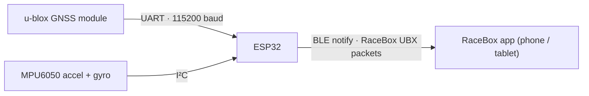
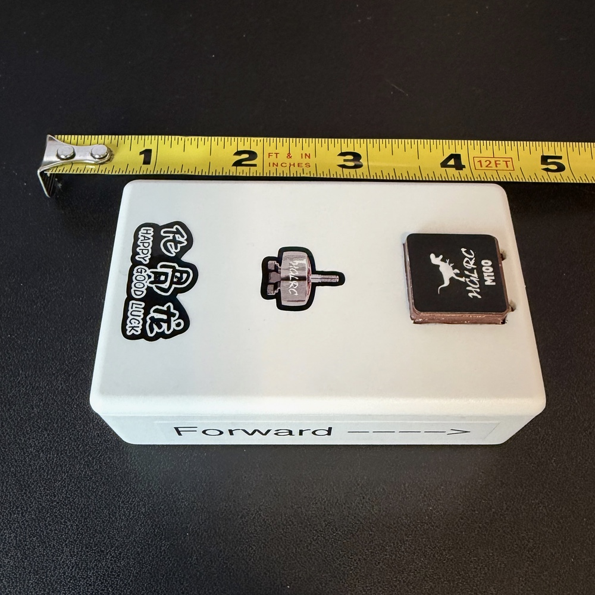
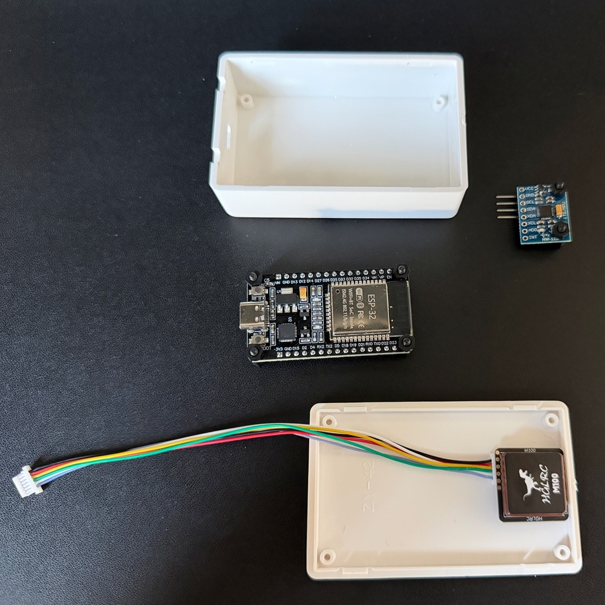
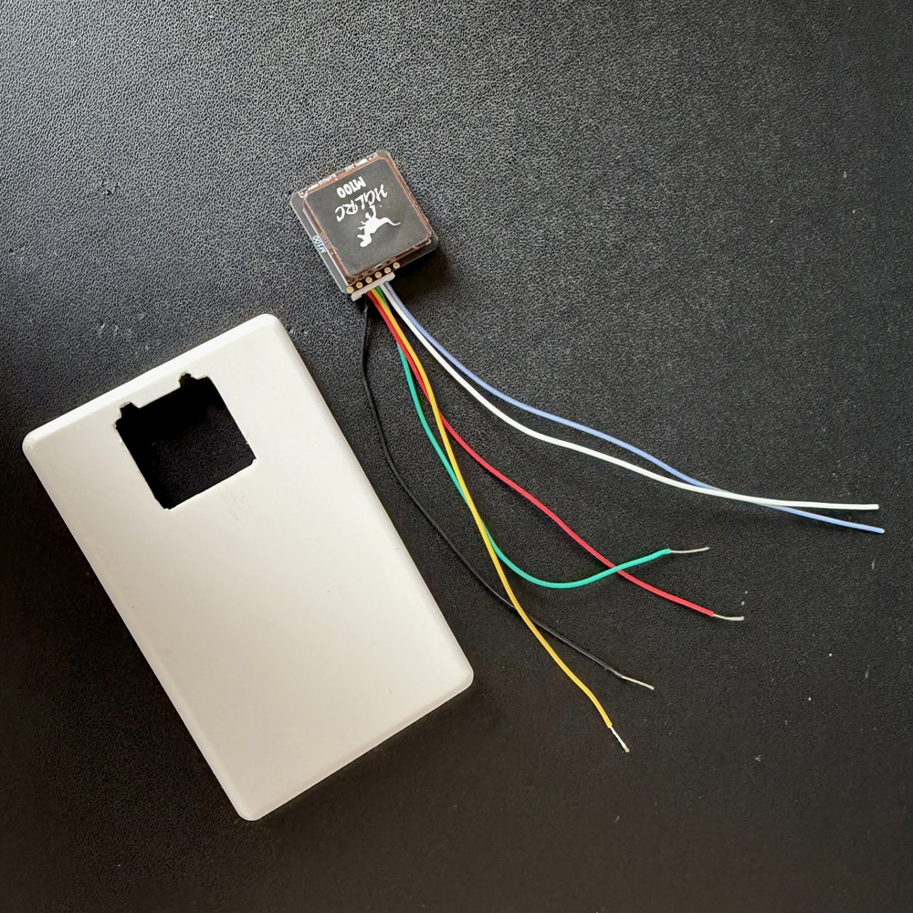
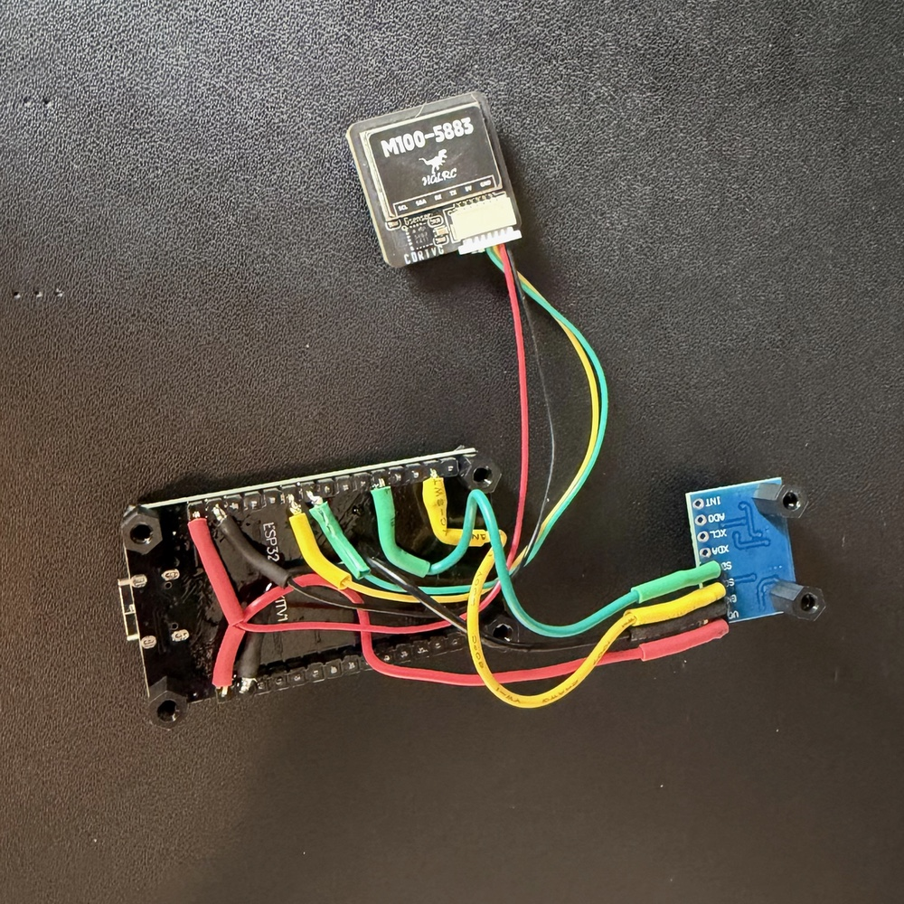
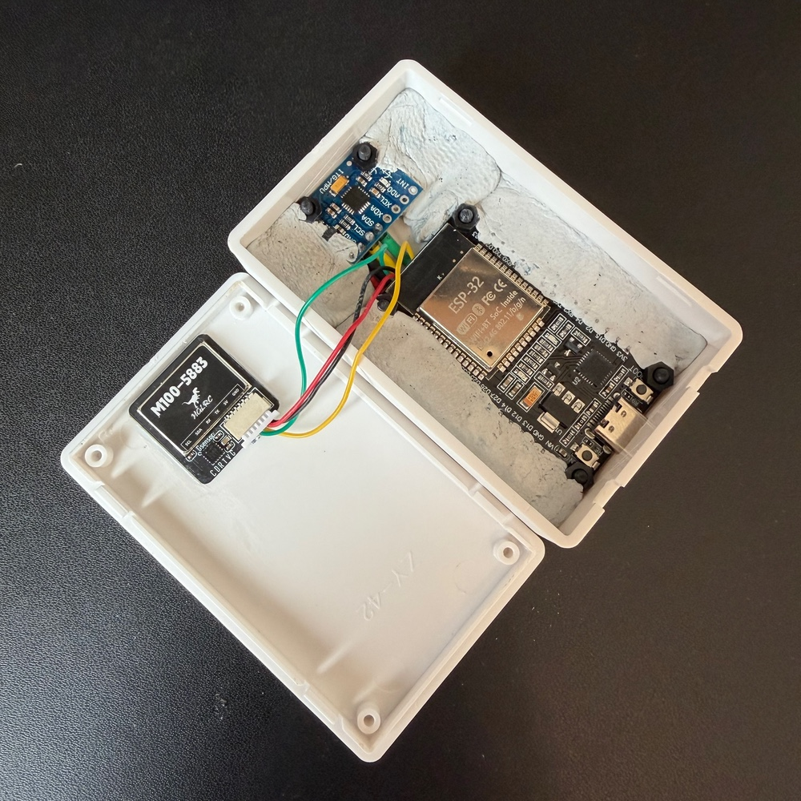
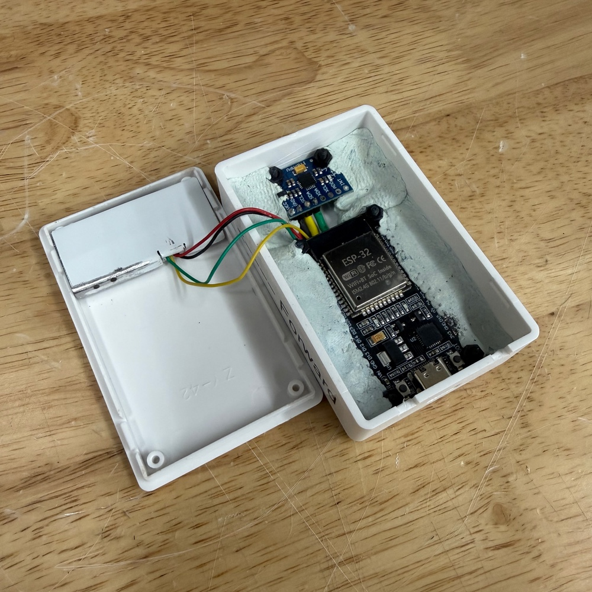
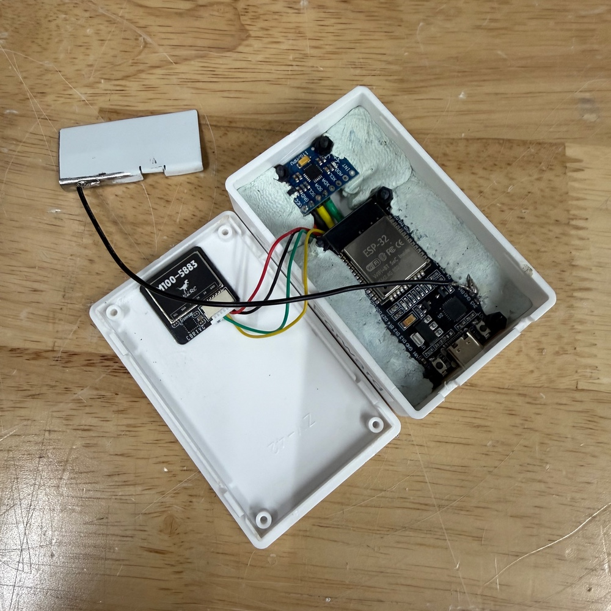
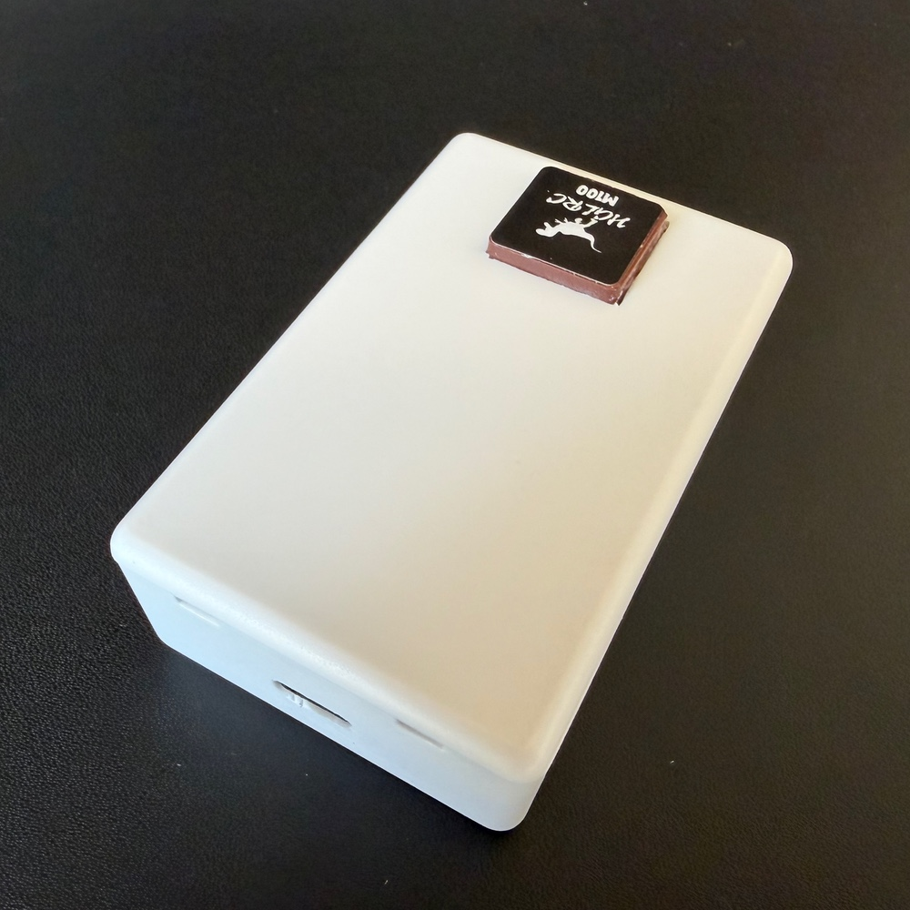

# Gnimu (nee-moo) - GNSS + IMU -> BLE telemetry

[-00599C.svg)](https://www.arduino.cc/)

The code in this repo lets you turn an ESP32 development board, a GNSS module, and an IMU module into a device that emulates the function of a [RaceBox Mini](https://www.racebox.pro/products/racebox-mini) performance meter. The official RaceBox app and other RaceBox-compatible tools should be able to connect to it over Bluetooth Low Energy (BLE) and read live position, speed, and motion data.

This is a low-cost, hackable platform for experimenting with GNSS and IMU data logging, the RaceBox BLE protocol, and sensor fusion built from off-the-shelf parts.

I originally started this project as a streaming GNSS+IMU source for use with the [AutoX Data Logger for iOS](https://autoxdrivermod.com) app.

> [!IMPORTANT]
> **Unofficial project.** This is an independent, educational, and non-commercial implementation. It is **not affiliated with, endorsed by, or supported by RaceBox.** "RaceBox" and related marks belong to their respective owner. Use this code for learning and personal experimentation only, and at your own risk. Do not use this code to impersonate a genuine device for any commercial or fraudulent purpose.

---

## What it does

- Reads a live [**GNSS fix**](https://en.wikipedia.org/wiki/Satellite_navigation) (position, altitude, speed, heading, accuracy, fix status, satellite count) from a u-blox GNSS receiver at up to **25 Hz**.
- Reads **acceleration and rotation** from an MPU6050 6-axis [**IMU**](https://en.wikipedia.org/wiki/Inertial_measurement_unit), with smoothing and optional gyro-bias calibration at startup.
- Packs everything into a **RaceBox Data Message** (a u-blox UBX-framed binary packet) and streams it over **BLE** to any RaceBox-compatible client.
- Advertises a BLE **Device Information Service** (model, serial, firmware, hardware, manufacturer) so official apps recognize and pair with it.
- Prints a human-readable **serial status line** at 1Hz for debugging: packet rate, GNSS data rate, satellite count, fix type, horizontal accuracy, position, and IMU values.

---

## Hardware

<table>
  <tr>
    <th width="28%" align="left">Part</th>
    <th align="left">Notes</th>
  </tr>
  <tr>
    <td><a href="https://www.amazon.com/dp/B0DF2YJSHN"><strong>ESP32 dev board</strong></a></td>
    <td>Developed on an AITRIP ESP32-WROOM-32 Development Board.</td>
  </tr>
  <tr>
    <td><a href="https://www.amazon.com/dp/B0CB5N8RQ8"><strong>u-blox GNSS module</strong></a></td>
    <td>A u-blox <a href="https://www.u-blox.com/en/product/max-m10-series">M10-class</a> receiver. Reference unit: <a href="https://www.hglrc.com/products/m100-5883-gps">HGLRC M100-5883</a>. Other u-blox modules supported by the SparkFun library should work.</td>
  </tr>
  <tr>
    <td><a href="https://www.amazon.com/dp/B01DK83ZYQ"><strong>IMU module</strong></a></td>
    <td>I²C 6-axis accelerometer + gyroscope breakout. Reference unit: HiLetgo GY-521 based on the <a href="https://invensense.tdk.com/products/motion-tracking/6-axis/mpu-6050/">InvenSense MPU-6050</a>.</td>
  </tr>
  <tr>
    <td><a href="https://www.amazon.com/dp/B0BQYPKRQS"><strong>Project Box</strong></a></td>
    <td>ABS Plastic Project Case, White, 3.15 x 1.97 x 1.02 inch (80 x 50 x 26 mm). You'll need to cut holes into this box to fit your specific board and component layout (see images below).</td>
  </tr>
  <tr>
    <td><a href="https://www.amazon.com/dp/B0FPMC9917"><strong>Nylon M2.5 hex standoffs</strong></a></td>
    <td>Nylon hex standoffs, washers, nuts, screws, to help with positioning the components within the project box.</td>
  </tr>
</table>

### Wiring

**GNSS module → ESP32 (UART, Serial2)**

| GNSS pin | ESP32 pin |
|----------|-----------|
| TX       | GPIO16 (RX2) |
| RX       | GPIO17 (TX2) |
| VCC      | 3V3 |
| GND      | GND |

**IMU module → ESP32 (I²C)**

| IMU pin | ESP32 pin |
|-------------|-----------|
| SDA         | GPIO21 (default I²C SDA) |
| SCL         | GPIO22 (default I²C SCL) |
| VCC         | VIN (5V pin) |
| GND         | GND |

**Status LED:** the onboard LED (GPIO2) blinks while waiting for a BLE connection and stays solid when a client is connected.

> Pin assignments for the GNSS UART and the LED are configurable in [`config.h`](src/esp32_racebox_mini_emulator/config.h). The IMU uses the ESP32's default I²C pins.

---

## Build gallery

Photos of the reference build, from loose components to the finished, enclosed unit. Several shots show an **RF shield** fitted over the electronics — a hardware counterpart to the firmware's reduced BLE power that further isolates the GNSS receiver from radio noise (see [A note on BLE power and GNSS lock](#a-note-on-ble-power-and-gnss-lock)).

   
  The completed emulator, decorated with the stickers that came with the GNSS module and an indicator of which end points forward (for Gyro/Accelerometer). &nbsp;

<table>
  <tr>
    <td align="center" valign="top" width="50%">
       
      Components and enclosure prior to assembly. &nbsp;
    </td>
    <td align="center" valign="top" width="50%">
       
      GNSS module with mounting hole in the lid. &nbsp;
    </td>
  </tr>
  <tr>
    <td align="center" valign="top" width="50%">
       
      Components wired together, using header pins underneath the ESP32 board. Extra unused pins were clipped off. &nbsp;
    </td>
    <td align="center" valign="top" width="50%">
       
      Assembled, using hardening epoxy putty to firmly affix the components.
    </td>
  </tr>
  <tr>
    <td align="center" valign="top" width="50%">
       
      RF shield test fit, not yet grounded or affixed. &nbsp;
    </td>
    <td align="center" valign="top" width="50%">
       
      RF shield grounded; I used two-sided tape to mount the shield. &nbsp;
    </td>
  </tr>
  <tr>
    <td align="center" valign="top" width="50%">
       
      Enclosure closed up, ready to test (before stickers!). &nbsp;
    </td>
    <td align="center" valign="top" width="50%">
       
      Connected to power, LEDs lit up. &nbsp;
    </td>
  </tr>
</table>

---

## Software & dependencies

- **[Arduino IDE](https://www.arduino.cc/en/software)** (2.x recommended).
- **ESP32 board support** — install the `esp32` package by Espressif via the Boards Manager.
- Libraries (install via Library Manager):
  - **Adafruit MPU6050** (pulls in Adafruit Unified Sensor + Adafruit BusIO)
  - **SparkFun u-blox GNSS Arduino Library**
  - BLE support is built into the ESP32 Arduino core — no extra install needed.

---

## Build & flash

### Arduino IDE

1. Install the ESP32 board package and the libraries listed above.
2. Open [`src/esp32_racebox_mini_emulator/esp32_racebox_mini_emulator.ino`](src/esp32_racebox_mini_emulator/esp32_racebox_mini_emulator.ino).
3. Edit [`config.h`](src/esp32_racebox_mini_emulator/config.h) (at minimum, set your `DEVICE_ID`).
4. Select your board (e.g. **ESP32 Dev Module**) and the correct serial port.
5. Click **Upload**.
6. Open the **Serial Monitor** at **115200 baud** to watch the startup and status output.

> [!IMPORTANT]
> If you are building on an Apple Silicon Mac, you can use the AS-native Arduino IDE but you **must** have Rosetta installed in order to correctly compile the ESP32 binary. Without Rosetta installed you will get a compilation error.
---

## Configuration

All user-tunable settings live in [`config.h`](src/esp32_racebox_mini_emulator/config.h), grouped into sections. Highlights:

| Setting | Purpose |
|---------|---------|
| `DEVICE_ID` | 10-digit device serial as a **quoted string** (e.g. `"3608675309"`). Validated at compile time: exactly 10 digits, first digit `0`–`3`. |
| `MODEL`, `FIRMWARE_VERSION`, `HARDWARE_VERSION`, `MANUFACTURER` | Values reported via the BLE Device Information Service. |
| `GNSS_RX_PIN`, `GNSS_TX_PIN`, `ONBOARD_LED_PIN` | Hardware pin assignments. |
| `GNSS_BAUD`, `FACTORY_GNSS_BAUD` | Serial baud rates. On first boot the firmware can detect a module at its factory baud, switch it to `GNSS_BAUD`, and save the config to flash. |
| `MAX_NAVIGATION_RATE` | GNSS update rate in Hz (1–25). |
| `ENABLE_GNSS_*` | Per-constellation toggles (GPS, Galileo, GLONASS, BeiDou, QZSS, SBAS). Enable only what your module/region supports. |
| `GYRO_CALIBRATION_ENABLED`, `GYRO_CALIBRATION_SAMPLES` | Startup gyro-bias calibration — keep the device still during the first second of boot. |
| `ACCEL_ALPHA`, `GYRO_ALPHA` | IMU smoothing (exponential moving average) strength. |
| `BLE_TX_POWER` | BLE transmit power. **Lowering this reduces RF interference with the GNSS front end and can noticeably improve satellite lock** — see notes below. |

Several values are checked with `static_assert` at compile time, so an invalid configuration fails the build with a clear message instead of misbehaving on the device.

### A note on BLE power and GNSS lock

GNSS reception is sensitive to nearby RF noise. On compact builds, the ESP32's BLE radio can desensitize the GNSS receiver. Dialing `BLE_TX_POWER` down to a low level (the default is `ESP_PWR_LVL_N12`, the minimum) keeps the radio quiet — the receiver is usually close by, so high power isn't needed — and can dramatically improve fix quality, including indoors.

The **RF shield** shown in the [build gallery](#build-gallery) is the hardware counterpart to this: a grounded metal enclosure over the GNSS module that physically blocks radio noise from reaching the GNSS receiver. The two measures stack — lowering the BLE power quiets the source, while the shield blocks whatever remains. Either helps on its own; together they give the most reliable lock.

With the BLE power level set to -12db, I have seen simultaneuous lock on as many as 20 satellites with horizontal accuracy (HAcc) as low as 220mm and [pDOP](https://en.wikipedia.org/wiki/Dilution_of_precision) values under 2 (really good for a cheap consumer-grade GNSS module).

---

## Usage

1. Power the assembled device and give the GNSS module time to acquire a fix (faster outdoors / near a window). The onboard LED blinks while unconnected.
2. In the **RaceBox app** (or another RaceBox-compatible client), scan for and connect to the device — it advertises using the `MODEL` + `DEVICE_ID` name.
3. On connect, the LED goes solid and the device begins streaming data packets.
4. Optional: keep a serial monitor open at 115200 baud to watch live diagnostics.

---

## Troubleshooting

| Symptom | Things to check |
|---------|-----------------|
| `Failed to find IMU module` | I²C wiring (SDA/SCL), 3V3 power, board address. |
| `u-blox GNSS not detected` | UART wiring (note TX↔RX crossover), `GNSS_BAUD` / `FACTORY_GNSS_BAUD`, module power. The sketch will attempt to auto-configure the baud rate. |
| Few or no satellites | Move outdoors / near a window; lower `BLE_TX_POWER`; give it a cold-start minute. |
| App won't connect | Confirm `DEVICE_ID` is valid (10 digits, first digit 0–3); make sure no other client is already connected. |
| Build fails with a `static_assert` message | Read the message — it names the offending `config.h` value and the allowed range. |

---

## Credits

This project is a major evolution of earlier work by [**Anchit Chandra Sekhar**](https://github.com/anchit92). Changes in this version include bug fixes, externalized configuration, a BLE transmit-power control, startup gyro calibration, and modularization of the codebase.

Protocol details follow the *RaceBox BLE Protocol Description* (rev 8), [available from RaceBox](https://www.racebox.pro/products/mini-micro-protocol-documentation).

---

## License

Released under the **GNU General Public License v3.0** — see [`LICENSE`](LICENSE).
